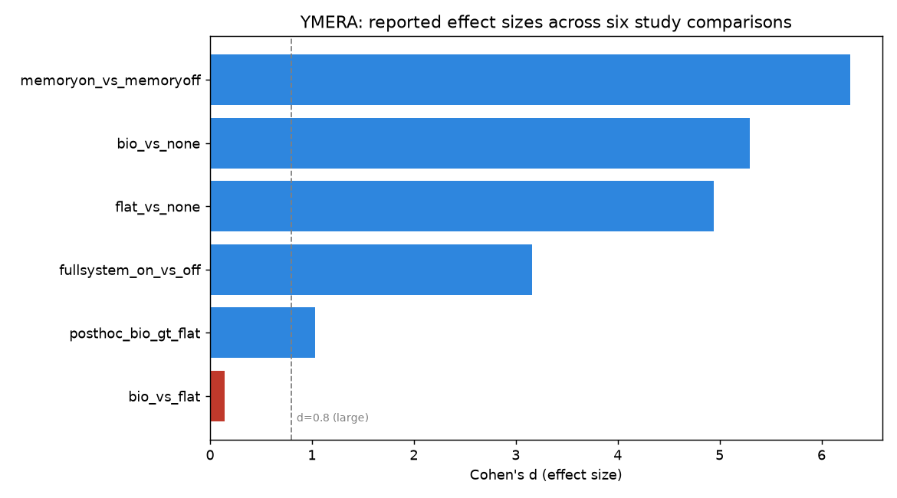

# YMERA — Memory Presence Matters, Mechanism Does Not

**A 21-agent organizational-simulation benchmark for LLM agent memory.**

[](https://doi.org/10.5281/zenodo.20256693)
[](https://creativecommons.org/licenses/by/4.0/)
[](https://www.kaggle.com/datasets/mohamed811/ymera-llm-agent-memory-ablation)

📄 **Paper:** https://doi.org/10.5281/zenodo.20256693 ·
📊 **Dataset:** https://www.kaggle.com/datasets/mohamed811/ymera-llm-agent-memory-ablation

> Mansour, Mohamed Fathy (2026). *Memory Presence Matters, Mechanism Does Not:
> Evidence from a 21-Agent Organizational Simulation on a Historical Economic
> Benchmark.* Zenodo. https://doi.org/10.5281/zenodo.20256693

This repository is the **public, sanitized writeup** of the YMERA study: the
paper, the headline results, and a short reproducible analysis of the published
effect sizes. It contains **no source code, no raw run data, and no credentials** —
only material already public in the Zenodo preprint (CC-BY-4.0).



*Memory **presence** produces enormous effect sizes (blue, d ≈ 5–6); memory
**mechanism** (bio vs. flat, red) does not separate (d = 0.14).*

---

## What the study found (in one line)

For LLM agents making organizational decisions, **having memory helps enormously,
but the *type* of memory mechanism (bio-inspired vs. flat retrieval) makes no broad
difference at 7B scale** — an honest positive *and* negative result.

## Why it matters

- **Evaluation, not anecdote.** A controlled, three-condition ablation with real
  significance testing and an explicit crisis-continuation protocol — the kind of
  rigorous, empirical LLM-agent evaluation that AI-data and safety work depends on.
- **An honest negative result.** The headline is partly a *null* (mechanism doesn't
  separate) — reported plainly, with limitations stated. That's real science, not
  hype.
- **Temporal isolation.** Agents are guarded against using future data they could
  not have had at decision time — a genuine problem for AI in regulated finance and
  healthcare.

## Abstract (verbatim from the paper)

> We introduce YMERA, a multi-agent simulation framework in which 21 AI executive
> agents deliberate over strategic, operational, financial, and risk decisions using a
> historical economic data surface spanning 1925–2024. In the current benchmarked
> experiments, we evaluate the 1925–1934 decade and compare three memory conditions:
> bio-inspired memory, flat retrieval memory, and no memory. In the canonical
> three-condition run (n=78 per arm), bio-memory and flat retrieval each substantially
> outperform no memory (d=5.30 and d=4.94, p<1e-58), while remaining statistically
> indistinguishable from each other (d=0.14, p=0.390). A larger full-era paired
> confirmation under an explicit crisis-continuation protocol reproduces the same result
> at greater magnitude (n=212/244, d=6.28, p=2.10e-195)... We conclude that memory
> presence strongly improves organizational AI decision quality, while bio-inspired
> mechanism complexity yields no broad advantage over flat retrieval at this model scale.

## Method (summary)

- **YMERA**: 21 AI executive agents (board roles, VPs, a Devil's Advocate) deliberate
  over strategic / operational / financial / risk decisions on a historical economic
  data surface spanning **1925–2024**.
- **Benchmark case study**: the 1925–1934 decade, comparing three memory conditions —
  **bio-inspired memory**, **flat retrieval**, and **no memory**.
- Model: Mistral-7B (AWS SageMaker). Temporal-isolation guards. Real-world calibration
  against the Philadelphia Fed Survey of Professional Forecasters.

## Headline results

| Comparison | n | Cohen's d | p | Protocol |
|---|---|---|---|---|
| bio-memory vs. no-memory | 78/arm | **5.30** | <1e-58 | canonical 3-condition |
| flat-retrieval vs. no-memory | 78/arm | **4.94** | <1e-58 | canonical 3-condition |
| bio vs. flat retrieval | 78/arm | 0.14 | 0.390 (n.s.) | canonical 3-condition |
| memory-on vs. memory-off | 212/244 | **6.28** | 2.10e-195 | full-era paired, crisis-continuation |
| full-system (7 layers) on vs. off | — | **3.16** | 2.52e-120 | temporally-guarded full-system |
| bio > flat (CEO+CHRO, crisis years) | — | 1.03 | 0.022 (Welch, exploratory) | post hoc |

Full numbers and method are in [`data/ymera_memory_ablation_results.csv`](data/ymera_memory_ablation_results.csv)
and reproduced by [`notebook/ymera_results_analysis.py`](notebook/ymera_results_analysis.py).

## Reproduce the analysis

```bash
pip install pandas matplotlib
python notebook/ymera_results_analysis.py
```

(This analysis works on the **published summary results**, not the raw simulation
runs — the point is a transparent, citable view of the effect sizes in the paper.)

## What is NOT here (by design)

The YMERA simulation **codebase is deliberately excluded** — it contains operational
credentials and is kept private. This repo is the scientific record and a clean,
recruiter/client-facing summary. For the full paper, see the DOI above.

## Skills this demonstrates

Directly relevant to LLM evaluation, AI-data, and red-teaming roles:

- **Rigorous LLM evaluation** — controlled multi-condition ablation, effect sizes,
  significance testing, and an honestly reported null result.
- **Multi-agent LLM systems** — designing and running a 21-agent deliberation framework.
- **Experimental hygiene** — temporal-isolation guards; real-world calibration against
  the Philadelphia Fed Survey of Professional Forecasters.
- **Reproducible reporting** — public dataset + runnable analysis + citable DOI.

## Author

**Mohamed Fathy Mansour** — Independent researcher; AI data, LLM evaluation, and
Arabic linguistic QA.
ORCID [0009-0005-4360-2567](https://orcid.org/0009-0005-4360-2567) ·
[LinkedIn](https://linkedin.com/in/mohamedmansour007) ·
[GitHub](https://github.com/momansour077)

## License

The paper and these summary results are released under **CC-BY-4.0**. Reuse with
attribution (cite the DOI above).
